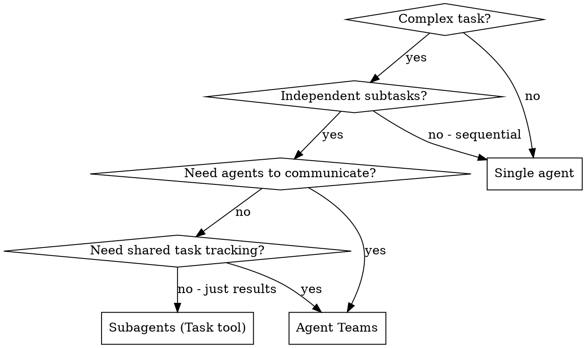

# Agent Teams

Coordinate multiple autonomous agents working on a shared task list with direct messaging.

**Core principle:** Teams for collaboration with shared state. Subagents for focused tasks returning results. Don't use teams when subagents suffice.

## When to Use



**Use teams:**
- Cross-layer work (frontend + backend + tests) needing coordination
- Research with multiple competing hypotheses sharing findings
- PR review with parallel security/performance/tests reviewers
- Large refactoring where agents own separate modules but must align

**Use subagents instead:**
- Focused tasks where you only need the result
- No inter-agent communication needed
- Simple parallel dispatch (use `dispatching-parallel-agents`)

## Teams vs Subagents

| Aspect | Subagents (Task) | Agent Teams (Teammate) |
|--------|-------------------|------------------------|
| Context | Own, returns summary | Own, fully independent |
| Communication | Only back to caller | Agents message each other |
| Coordination | Caller manages all | Shared task list + self-coordination |
| Cost | Lower (summarized results) | Higher (each agent = separate Claude) |
| File conflicts | Caller integrates | Risk if agents edit same files |
| Best for | Focused tasks, results matter | Collaboration, discussion matters |

## Lifecycle

### 1. Create Team

```
Teammate(operation="spawnTeam", team_name="my-feature", description="Building auth module")
```

Creates:
- `~/.claude/teams/my-feature/config.json` — members registry
- `~/.claude/tasks/my-feature/` — shared task list

### 2. Create Tasks

```
TaskCreate(subject="Implement JWT middleware", description="...", activeForm="Implementing JWT middleware")
TaskCreate(subject="Write auth API tests", description="...", activeForm="Writing auth tests")
```

### 3. Spawn Teammates

Use `Task` tool with `team_name` and `name`:

```
Task(
    subagent_type="general-purpose",
    team_name="my-feature",
    name="backend-dev",
    prompt="You are a backend developer. Check TaskList for your assignments."
)
Task(
    subagent_type="general-purpose",
    team_name="my-feature",
    name="test-writer",
    prompt="You are a test specialist. Check TaskList for your assignments."
)
```

### 4. Assign Tasks

```
TaskUpdate(taskId="1", owner="backend-dev")
TaskUpdate(taskId="2", owner="test-writer")
```

### 5. Monitor & Communicate

```
SendMessage(type="message", recipient="backend-dev", content="Use httpOnly cookies for tokens", summary="JWT storage guidance")
```

Teammates auto-notify you when idle (turn ended). This is normal — idle means waiting, not done.

### 6. Shutdown

```
SendMessage(type="shutdown_request", recipient="backend-dev", content="Work complete")
SendMessage(type="shutdown_request", recipient="test-writer", content="Work complete")
# Wait for confirmations, then:
Teammate(operation="cleanup")
```

## Best Practices

### Task Sizing

- 5-6 tasks per teammate is optimal
- Too small → coordination overhead > value
- Too large → no checkpoints, hard to monitor
- Each task should have clear deliverable (file, function, test suite)

### Prevent File Conflicts

Two agents editing same file = overwrites. Partition by ownership:

```
backend-dev  → src/auth/middleware.ts, src/auth/jwt.ts
test-writer  → tests/auth/*.test.ts
```

**If overlap unavoidable:** sequence the tasks with `addBlockedBy`.

### Context for Teammates

Teammates DON'T inherit your conversation history. They get:
- CLAUDE.md + rules
- MCP servers, skills
- Your spawn prompt

**Make spawn prompts rich:**

```
❌ "Fix the auth bug"
✅ "Fix JWT expiry bug in src/auth/jwt.ts. Token refresh fails when
    access token expires but refresh token is valid. Error: 'TokenExpiredError'
    at line 42. The refresh logic in refreshAccessToken() doesn't check
    refresh token validity before attempting renewal. Write tests first."
```

### Communication Patterns

**Lead → Teammate:** Direct message with context
```
SendMessage(type="message", recipient="backend-dev",
    content="The DB schema changed - users table now has 'role' column",
    summary="Schema change notification")
```

**Broadcast (use sparingly — sends to ALL):**
```
SendMessage(type="broadcast", content="Blocking bug found, pause work", summary="Stop all work")
```

**Plan approval:** Spawn teammate in plan mode, review their plan before they implement.

### Idle State

Teammates go idle after every turn. This is **normal behavior**, not an error:
- Idle = waiting for input
- Sending a message wakes them up
- Don't react to idle notifications unless assigning new work

## Common Mistakes

| Mistake | Fix |
|---------|-----|
| Using teams for sequential work | Use single agent or subagents |
| Not partitioning files by agent | Assign file ownership explicitly |
| Sparse spawn prompts | Include full context, don't assume shared history |
| Broadcasting routine messages | Use direct `message` to specific teammate |
| Reacting to every idle notification | Idle is normal, only respond when needed |
| Forgetting cleanup | Always `shutdown_request` all → then `cleanup` |
| Starting code before teammates finish | Wait for results, verify, then integrate |
| Too many teammates | 2-4 optimal, more = coordination overhead |

## Anti-Patterns

**Pipeline anti-pattern:** Don't split sequential phases into separate agents (planning → implementation → testing). One agent doing all three is cheaper and avoids handoff loss.

**Manager-only lead:** Don't just coordinate — the lead agent should also do work. Delegate mode is for complex orchestration only.

**Over-communication:** Don't broadcast status updates. Use TaskUpdate to mark progress — teammates check TaskList themselves.

## Quick Reference

| Tool | Purpose |
|------|---------|
| `Teammate(operation="spawnTeam")` | Create team |
| `Task(team_name=..., name=...)` | Spawn teammate |
| `TaskCreate` / `TaskList` / `TaskUpdate` | Manage shared tasks |
| `SendMessage(type="message")` | DM a teammate |
| `SendMessage(type="broadcast")` | Message all (use sparingly) |
| `SendMessage(type="shutdown_request")` | Graceful shutdown |
| `Teammate(operation="cleanup")` | Remove team resources |

## Limitations (Current)

- No `/resume` for in-process teammates
- One team per session
- No nested teams (teammates can't create sub-teams)
- Lead is fixed for lifecycle
- Split panes need tmux/iTerm2 (not VS Code terminal)
- Task status may lag — teammates sometimes forget to mark `completed`
