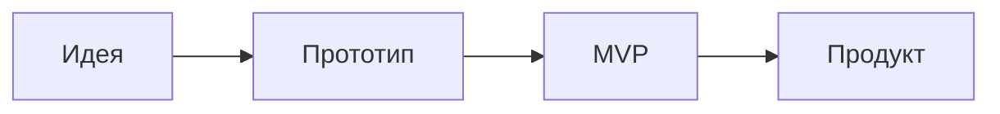
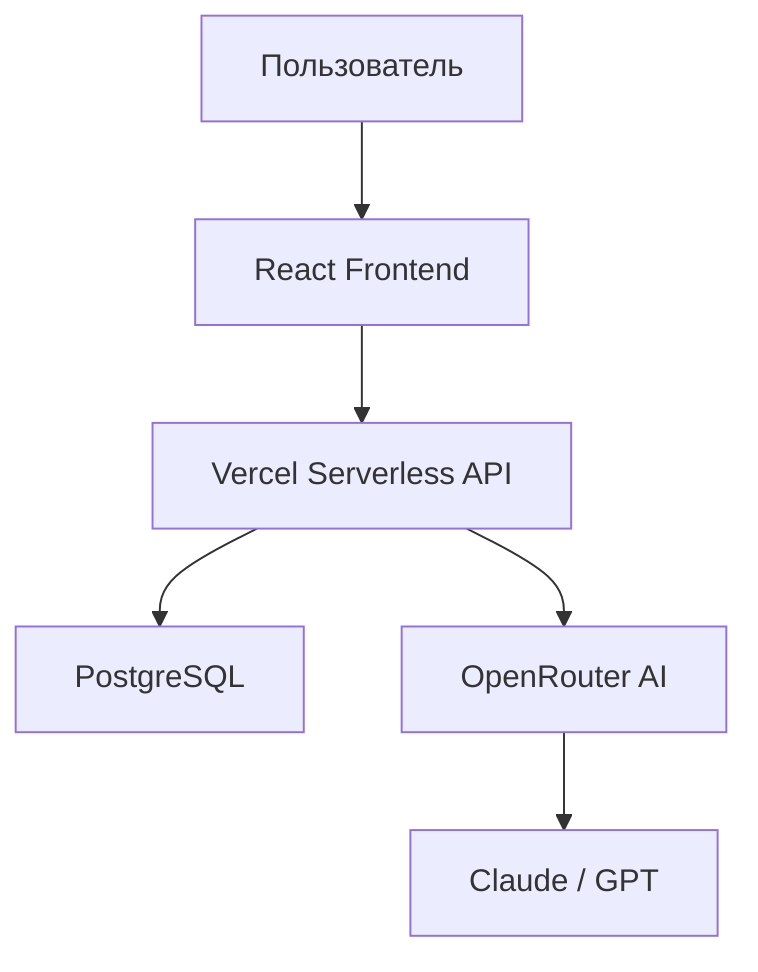

# Slidev — Skill для создания презентаций

## When to Use

Используй этот скилл когда пользователь просит:
- Создать презентацию / слайды / доклад
- Работать с Slidev
- Сконвертировать текст/тему в презентацию

**НЕ используй** для:
- Обычных UI-компонентов (используй `frontend-design`)
- Статических HTML-страниц без слайдов
- PDF-документов без презентационного формата

## Workflow

### Шаг 1: Бриф

Через `AskUserQuestion` уточни:

1. **Тема** — о чём презентация?
2. **Аудитория** — для кого (студенты, коллеги, конференция)?
3. **Количество слайдов** — примерное (по умолчанию 10-15)
4. **Тема оформления** — seriph (элегантная), default, apple-basic (по умолчанию seriph)
5. **Язык** — русский / английский / другой
6. **Особые пожелания** — код, диаграммы, формулы, изображения?

### Шаг 2: Outline (структура)

Покажи пользователю план слайдов в виде таблицы:

```
| # | Layout | Заголовок | Содержание |
|---|--------|-----------|------------|
| 1 | cover | Название презентации | Автор, дата |
| 2 | intro | О чём поговорим | Краткий план |
| 3 | section | Часть 1 | Разделитель |
| ...| ... | ... | ... |
| N | end | Спасибо! | Контакты |
```

**КРИТИЧНО:** Используй минимум 4 разных лейаута. Лейаут `default` — не более 30% слайдов.

Дождись одобрения перед генерацией.

### Шаг 3: Генерация slides.md

Создай файл `slides.md` с полным содержанием. Требования:

- **Разнообразие лейаутов** — min 4 разных типа, max 30% default
- **Click-анимации** — используй `v-click` для пошагового появления
- **Speaker notes** — добавь заметки для докладчика через `<!-- комментарии -->`
- **Code highlighting** — с подсветкой строк `{2,4-6}` где уместно
- **Mermaid-диаграммы** — где подходит по контексту
- **Transitions** — указывай transition в headmatter

### Шаг 4: Создание проекта

Предложи два варианта:

**A) Быстрый старт** (рекомендуется для одноразовых презентаций):
```bash
mkdir presentation && cd presentation
# Создать slides.md
slidev slides.md
```

**B) Полный проект** (для повторного использования):
```bash
npm init slidev@latest
# Заменить slides.md сгенерированным контентом
```

### Шаг 5: Preview и экспорт

Предложи варианты:
- `slidev` — dev-сервер с hot reload на http://localhost:3030
- `slidev export` — экспорт в PDF
- `slidev export --format pptx` — экспорт в PowerPoint
- `slidev build` — статический SPA для деплоя

---

## Quick Reference

### Лейауты (встроенные)

| Layout | Описание | Слоты |
|--------|----------|-------|
| `cover` | Титульный слайд | — |
| `intro` | Введение с автором | — |
| `default` | Базовый, любой контент | — |
| `center` | Контент по центру | — |
| `section` | Разделитель секций | — |
| `statement` | Утверждение крупным текстом | — |
| `fact` | Факт/число крупно | — |
| `quote` | Цитата | — |
| `two-cols` | Два столбца | `::right::` |
| `two-cols-header` | Заголовок + два столбца | `::left::` `::right::` |
| `image` | Полноэкранное изображение | — |
| `image-left` | Картинка слева, текст справа | — |
| `image-right` | Картинка справа, текст слева | — |
| `iframe` | Встроенная веб-страница | — |
| `iframe-left` | Iframe слева, текст справа | — |
| `iframe-right` | Iframe справа, текст слева | — |
| `full` | Контент на весь экран | — |
| `end` | Финальный слайд | — |
| `none` | Без стилей | — |

### Темы

| Тема | Стиль |
|------|-------|
| `default` | Минималистичная, без засечек |
| `seriph` | Элегантная, с засечками |
| `apple-basic` | В стиле Apple Keynote |
| `shibainu` | Тёмная, современная |
| `bricks` | Кирпичный стиль |

### Click-анимации

```md
<v-click>

- Этот пункт появится по клику

</v-click>

<v-clicks>

- Каждый пункт
- Появляется
- По отдельности

</v-clicks>
```

Подсветка строк кода по кликам:
````md
```ts {1|2-3|all}
const a = 1
const b = 2
const c = a + b
```
````

### Transitions (переходы между слайдами)

В headmatter:
```yaml
transition: slide-left    # slide-left, slide-right, slide-up, slide-down
transition: fade          # fade, fade-out
transition: view-transition
```

Per-slide:
```md
---
transition: fade
---
```

### Mermaid-диаграммы

````md

````

### LaTeX-формулы

```md
Инлайн: $E = mc^2$

Блок:
$$
\int_0^\infty e^{-x^2} dx = \frac{\sqrt{\pi}}{2}
$$
```

### Speaker Notes

```md
---
layout: default
---

# Заголовок слайда

Контент для аудитории

<!--
Заметки для докладчика.
Поддерживают **markdown** и HTML.
Видны только в Presenter Mode (http://localhost:3030/presenter/)
-->
```

---

## Headmatter Template

```yaml
---
theme: seriph
title: "Название презентации"
info: |
  Описание презентации.
  Автор: Имя Фамилия
author: Имя Фамилия
keywords: ключевые,слова
transition: slide-left
mdc: true
---
```

---

## Common Mistakes

| Ошибка | Решение |
|--------|---------|
| Все слайды на `default` | Используй min 4 разных лейаута |
| `npx slidev` не работает | Используй установленный CLI: `slidev slides.md` |
| Забыл `::right::` в `two-cols` | Без слота правая колонка будет пустой |
| Нет пустой строки перед `---` | Разделитель слайдов требует пустые строки до и после |
| `v-click` без пустых строк | Оборачивай содержимое пустыми строками внутри `<v-click>` |
| Кириллица в meta | Используй кавычки: `title: "Привет мир"` |
| Слишком много текста на слайде | Разбей на несколько слайдов, используй `v-clicks` |

---

## Full Example

````md
---
theme: seriph
title: "Вайб-кодинг: Будущее разработки"
author: Александр
transition: slide-left
mdc: true
---

# Вайб-кодинг

## Будущее разработки с AI

<div class="pt-12">
  <span @click="$slidev.nav.next" class="px-2 py-1 rounded cursor-pointer" hover="bg-white bg-opacity-10">
    Начать <carbon:arrow-right class="inline"/>
  </span>
</div>

<!--
Приветствие аудитории. Представиться.
Сказать что презентация займёт ~20 минут.
-->

---
layout: intro
---

# Александр

<div class="leading-8 opacity-80">
Fullstack-разработчик<br>
Преподаватель вайб-кодинга<br>
</div>

---
layout: section
---

# Часть 1
## Что такое вайб-кодинг?

---

# Определение

Вайб-кодинг — это подход к разработке, где вы:

<v-clicks>

- Описываете задачу на естественном языке
- AI генерирует код
- Вы направляете и корректируете результат
- Итерируете до готового продукта

</v-clicks>

<!--
Термин ввёл Андрей Карпатый в 2025 году.
-->

---
layout: quote
---

# "You just see stuff, say stuff, run stuff, and vibe."

— Andrej Karpathy, 2025

---
layout: two-cols
---

# Традиционный подход

- Изучение синтаксиса
- Написание кода вручную
- Долгая отладка
- Высокий порог входа

::right::

# Вайб-кодинг

- Описание на естественном языке
- AI генерирует код
- Быстрая итерация
- Низкий порог входа

---
layout: fact
---

# 10x
Ускорение разработки прототипов с AI

---
layout: section
---

# Часть 2
## Инструменты

---
layout: image-right
image: https://images.unsplash.com/photo-1555066931-4365d14bab8c?w=800
---

# Стек технологий

<v-clicks>

- **Claude Code** — AI-ассистент в терминале
- **Cursor** — AI-powered IDE
- **React + Vite** — фронтенд
- **Vercel** — деплой

</v-clicks>

---

# Пример кода

Запрос к AI и результат:

```ts {1-3|5-10|all}
// Запрос: "Создай функцию валидации email"

// AI сгенерировал:
function validateEmail(email: string): boolean {
  const re = /^[^\s@]+@[^\s@]+\.[^\s@]+$/
  return re.test(email)
}

// Работает из коробки!
console.log(validateEmail('test@example.com')) // true
```

---

# Архитектура проекта



---
layout: end
---

# Спасибо!

Вопросы?

[GitHub](https://github.com) · [Telegram](https://t.me)
````
